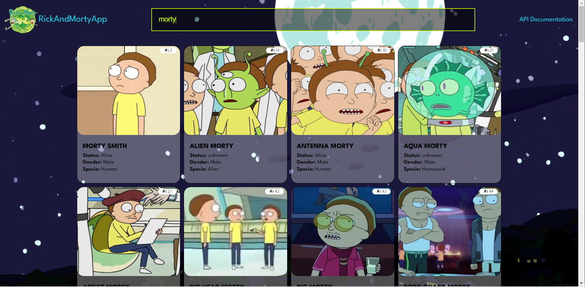
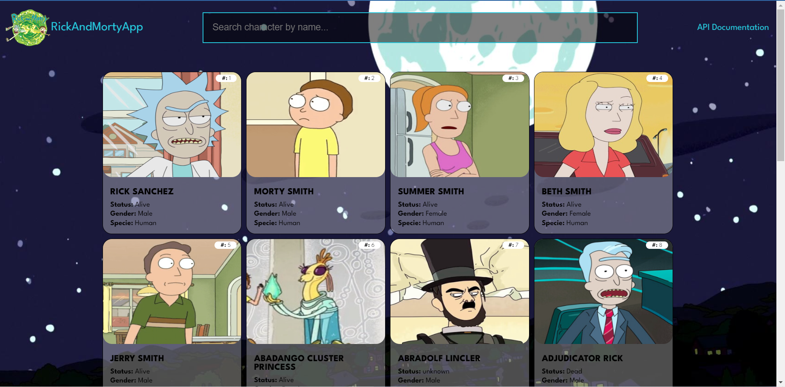
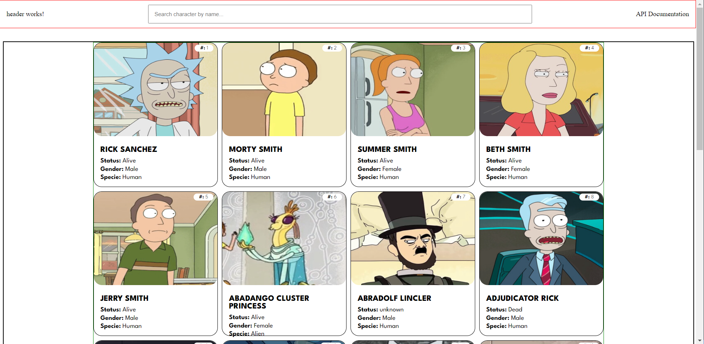

# RickandmortyTest
This project was built for a technical interview... Designed by [jaqudev_](https://github.com/jhonaquejadau)

# Screenshots

**Version v0.3.0**

**Version v0.2.0**

**Version v0.1.2**

**Version v0.1.1**

# Versions

**v0.3.0**

* Ngx pagination added.
* Services refactor.
* Input form refactor.

**v0.2.0**

* Form input working.
* Styles updates.

**v0.1.2**

* New styles added.

**v0.1.1**

* TS alias path for imports configured.
* New environment credential folder.
* New fonts styles.
* New Search input.
* Project structure:
    - Interfaces fodler.
    - Pages folder.
    - Shared folder.
 
# Libraries, Frameworks, Technologies

* NodeJs
* JavaScript - TypeScript
* Css - Html
* Angular
* HttpClientModule
* Class components

# Credits 
Thanks to [RickAndMortyApi](https://rickandmortyapi.com/documentation/#introduction) for creating an awesome API for developers. I appreciate your team's hard work in providing the data needed to take my coding skills to the next level.

# Copyright Note
This is a project for a technical interview, is non-commercial. This, is just for improve my web development skills using. Don't heasitate left me a like in mi repos.

# ANGULAR - GUIDE
This project was generated with [Angular CLI](https://github.com/angular/angular-cli) version 15.1.4.

## Development server

Run `ng serve` for a dev server. Navigate to `http://localhost:4200/`. The application will automatically reload if you change any of the source files.

## Code scaffolding

Run `ng generate component component-name` to generate a new component. You can also use `ng generate directive|pipe|service|class|guard|interface|enum|module`.

## Build

Run `ng build` to build the project. The build artifacts will be stored in the `dist/` directory.

## Running unit tests

Run `ng test` to execute the unit tests via [Karma](https://karma-runner.github.io).

## Running end-to-end tests

Run `ng e2e` to execute the end-to-end tests via a platform of your choice. To use this command, you need to first add a package that implements end-to-end testing capabilities.

## Further help

To get more help on the Angular CLI use `ng help` or go check out the [Angular CLI Overview and Command Reference](https://angular.io/cli) page.
